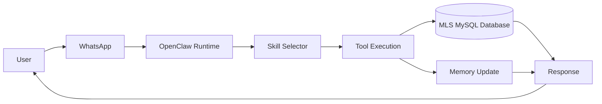

# IDX Exchange 2026 Summer Internship - Weekly Progress

This repository records my first-week progress as an AI Agentic Engineer Intern at IDX Exchange.

## Week 0 - Environment Setup and Configuration

The first milestone was to prepare a working local agent environment and confirm that the data and messaging pipeline were ready for development.

- Installed OpenClaw locally and configured the development environment.
- Created the local MySQL `idx_exchange` database.
- Imported the MLS active listings dataset into `rets_property`.
- Imported the sold comparables dataset into `california_sold`.
- Verified the imported database row counts after setup.
- Configured required API keys and service credentials through local environment variables.
- Connected WhatsApp through QR code device linking.
- Verified the end-to-end agent communication pipeline with a test WhatsApp message.

## Week 1 - OpenClaw Architecture Fundamentals

The second milestone was to understand how OpenClaw routes user requests from a messaging channel into skills, tools, memory, and a final response.

- Studied the OpenClaw runtime architecture and its main responsibilities.
- Mapped the query flow from WhatsApp into the OpenClaw runtime.
- Reviewed the role of skills, channels, sessions, tools, memory, and the orchestrator.
- Drafted a simple tool-handler pattern for routing user messages to typed asynchronous functions.
- Documented how future MLS-related skills can connect OpenClaw queries to the local MySQL datasets.

### Architecture Flow



### Current Status

The local environment, MLS database import, WhatsApp connection, and first architecture review are complete. The next step is to build real estate focused OpenClaw skills that can query MLS data and return useful property insights through WhatsApp.

### Security Note

No API keys, passwords, local `.env` files, SQL dumps, or database files are stored in this repository.

## Week 2: Natural Language Real Estate Query Parser

### Overview

This week’s work implements a TypeScript OpenClaw skill that converts free-text real estate search queries into structured filter objects for the `rets_property` database layer.

For example:

> Show me 3-bedroom condos in Irvine under $1.5M with a pool.

The parser converts the query into structured fields such as city, maximum price, bedrooms, property type, and property features.

### Goal

The goal is to create a rule-based natural language parser that acts as the front-end for real estate search. Instead of requiring users to manually fill out database filters, the skill extracts search intent from a normal sentence and maps it to `rets_property` columns.

### Supported Filters

| User Intent | Output Field | Database Column | Example |
|---|---|---|---|
| City | `city` | `L_City` | `"Irvine"` |
| Maximum Price | `maxPrice` | `L_SystemPrice` | `1500000` |
| Minimum Bedrooms | `beds` | `L_Keyword2` | `3` |
| Minimum Bathrooms | `baths` | `LM_Dec_3` | `2.5` |
| Minimum Square Feet | `sqft` | `LM_Int2_3` | `1800` |
| Property Type | `type` | `L_Type_` | `"Condominium"` |
| Pool | `pool` | `PoolPrivateYN` | `"True"` |
| View | `hasView` | `ViewYN` | `"True"` |
| Maximum HOA | `maxHoa` | `AssociationFee` | `500` |

### Features

- Parses prices like `$900k`, `$1.5M`, and `$1,200,000`
- Detects bedrooms from `3 bed`, `3 beds`, and `3-bedroom`
- Detects bathrooms from `2 bath`, `2.5 baths`, and `3 bathrooms`
- Detects square footage from `1800 sqft`, `1800 sq ft`, and `1800 square feet`
- Maps property types:
  - `condo` -> `Condominium`
  - `townhome` -> `Townhouse`
  - `single family` -> `SingleFamilyResidence`
  - `land` -> `UnimprovedLand`
- Detects pool and view requests
- Extracts HOA limits such as `max HOA 500` and `HOA under 500`

### Project Structure

```text
skill/
  src/
    parser.ts
    index.ts
  tests/
    parser.test.mjs
  package.json
  package-lock.json
  tsconfig.json
```

## Week 3 - MLS MySQL Query Layer Integration

This week focused on connecting the existing real-estate query parser to a real MLS-backed MySQL query layer. The goal was to move beyond parsing user messages into filters, and begin building the database access layer that downstream OpenClaw agents can use to search active listings and sold comparable properties.

### Goal

The main objective was to connect the `skill/` project to two local MLS database tables:

- `rets_property` for active property listings
- `california_sold` for sold comparable properties

The implementation emphasizes safe SQL construction, reusable query functions, predictable pagination, and clean result formatting for agent consumption.

### Key Work Completed

The existing `skill/` package was extended instead of creating a new root-level Node project. This keeps the Week 3 work aligned with the Week 2 parser structure.

The following files were added or updated:

- `skill/src/db.ts`
  - Creates a reusable MySQL connection pool using `mysql2/promise`.
  - Reads database configuration from environment variables.
  - Exposes a shared `query<T>()` helper for parameterized SQL execution.

- `skill/src/mlsQueries.ts`
  - Adds the MLS query layer.
  - Implements `searchActiveListings()`.
  - Implements `getSoldComps()`.
  - Includes SQL builder functions for testable query construction.
  - Formats raw MLS rows into clean camelCase objects for agents.

- `skill/src/index.ts`
  - Continues exporting the existing parser utilities.
  - Now also exports the new MLS query functions.

- `skill/tests/mlsQueries.test.mjs`
  - Adds unit tests for SQL construction, pagination, injection safety, and result formatting.

- `skill/package.json`
  - Adds `mysql2` as a dependency.
  - Expands the test and check scripts to include the new query layer.

- `.gitignore`
  - Protects local secrets, dependencies, build outputs, logs, database files, and virtual environments from being committed.

- `.env.example`
  - Documents the required environment variables without exposing real credentials.

### Active Listing Search

The active listing query targets the `rets_property` table and always filters for active listings using:

```sql
L_Status = "Active"
