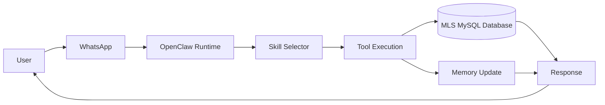

# IDX Exchange 2026 Summer Internship - Weekly Progress

This repository records my first-week progress as an AI Agentic Engineer Intern at IDX Exchange.

## Week 0 - Environment Setup and Configuration

The first milestone was to prepare a working local agent environment and confirm that the data and messaging pipeline were ready for development.

- Installed OpenClaw locally and configured the development environment.
- Created the local MySQL `idx_exchange` database.
- Imported the MLS active listings dataset into `rets_property`.
- Imported the sold comparables dataset into `california_sold`.
- Verified the imported database row counts after setup.
- Configured required API keys and service credentials through local environment variables.
- Connected WhatsApp through QR code device linking.
- Verified the end-to-end agent communication pipeline with a test WhatsApp message.

## Week 1 - OpenClaw Architecture Fundamentals

The second milestone was to understand how OpenClaw routes user requests from a messaging channel into skills, tools, memory, and a final response.

- Studied the OpenClaw runtime architecture and its main responsibilities.
- Mapped the query flow from WhatsApp into the OpenClaw runtime.
- Reviewed the role of skills, channels, sessions, tools, memory, and the orchestrator.
- Drafted a simple tool-handler pattern for routing user messages to typed asynchronous functions.
- Documented how future MLS-related skills can connect OpenClaw queries to the local MySQL datasets.

## Architecture Flow

## Current Status

The local environment, MLS database import, WhatsApp connection, and first architecture review are complete. The next step is to build real estate focused OpenClaw skills that can query MLS data and return useful property insights through WhatsApp.

## Security Note

No API keys, passwords, local `.env` files, SQL dumps, or database files are stored in this repository.
