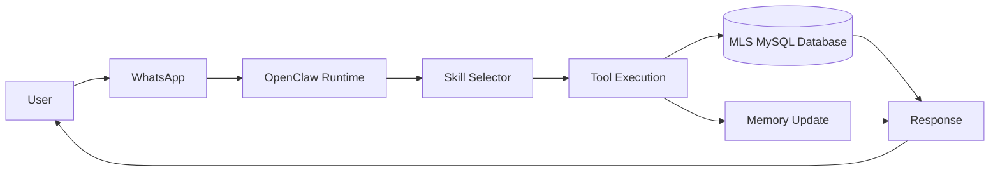

# IDX Exchange 2026 Summer Internship - Weekly Progress

This repository records my first-week progress as an AI Agentic Engineer Intern at IDX Exchange.

## Week 0 - Environment Setup and Configuration

The first milestone was to prepare a working local agent environment and confirm that the data and messaging pipeline were ready for development.

- Installed OpenClaw locally and configured the development environment.
- Created the local MySQL `idx_exchange` database.
- Imported the MLS active listings dataset into `rets_property`.
- Imported the sold comparables dataset into `california_sold`.
- Verified the imported database row counts after setup.
- Configured required API keys and service credentials through local environment variables.
- Connected WhatsApp through QR code device linking.
- Verified the end-to-end agent communication pipeline with a test WhatsApp message.

## Week 1 - OpenClaw Architecture Fundamentals

The second milestone was to understand how OpenClaw routes user requests from a messaging channel into skills, tools, memory, and a final response.

- Studied the OpenClaw runtime architecture and its main responsibilities.
- Mapped the query flow from WhatsApp into the OpenClaw runtime.
- Reviewed the role of skills, channels, sessions, tools, memory, and the orchestrator.
- Drafted a simple tool-handler pattern for routing user messages to typed asynchronous functions.
- Documented how future MLS-related skills can connect OpenClaw queries to the local MySQL datasets.

### Architecture Flow


```mermaid
flowchart LR
  User[User] --> WhatsApp[WhatsApp]
  WhatsApp --> Runtime[OpenClaw Runtime]
  Runtime --> Selector[Skill Selector]
  Selector --> Tools[Tool Execution]
  Tools --> Database[(MLS MySQL Database)]
  Tools --> Memory[Memory Update]
  Database --> Response[Response]
  Memory --> Response
  Response --> User
```

### Current Status

The local environment, MLS database import, WhatsApp connection, and first architecture review are complete. The next step is to build real estate focused OpenClaw skills that can query MLS data and return useful property insights through WhatsApp.

### Security Note

No API keys, passwords, local `.env` files, SQL dumps, or database files are stored in this repository.

## Week 2: Natural Language Real Estate Query Parser

### Overview

This week’s work implements a TypeScript OpenClaw skill that converts free-text real estate search queries into structured filter objects for the `rets_property` database layer.

For example:

> Show me 3-bedroom condos in Irvine under $1.5M with a pool.

The parser converts the query into structured fields such as city, maximum price, bedrooms, property type, and property features.

### Goal

The goal is to create a rule-based natural language parser that acts as the front-end for real estate search. Instead of requiring users to manually fill out database filters, the skill extracts search intent from a normal sentence and maps it to `rets_property` columns.

### Supported Filters

| User Intent | Output Field | Database Column | Example |
|---|---|---|---|
| City | `city` | `L_City` | `"Irvine"` |
| Maximum Price | `maxPrice` | `L_SystemPrice` | `1500000` |
| Minimum Bedrooms | `beds` | `L_Keyword2` | `3` |
| Minimum Bathrooms | `baths` | `LM_Dec_3` | `2.5` |
| Minimum Square Feet | `sqft` | `LM_Int2_3` | `1800` |
| Property Type | `type` | `L_Type_` | `"Condominium"` |
| Pool | `pool` | `PoolPrivateYN` | `"True"` |
| View | `hasView` | `ViewYN` | `"True"` |
| Maximum HOA | `maxHoa` | `AssociationFee` | `500` |

### Features

- Parses prices like `$900k`, `$1.5M`, and `$1,200,000`
- Detects bedrooms from `3 bed`, `3 beds`, and `3-bedroom`
- Detects bathrooms from `2 bath`, `2.5 baths`, and `3 bathrooms`
- Detects square footage from `1800 sqft`, `1800 sq ft`, and `1800 square feet`
- Maps property types:
  - `condo` -> `Condominium`
  - `townhome` -> `Townhouse`
  - `single family` -> `SingleFamilyResidence`
  - `land` -> `UnimprovedLand`
- Detects pool and view requests
- Extracts HOA limits such as `max HOA 500` and `HOA under 500`

### Project Structure

```text
skill/
  src/
    parser.ts
    index.ts
  tests/
    parser.test.mjs
  package.json
  package-lock.json
  tsconfig.json
```

## Week 3 - MLS MySQL Query Layer Integration

This week focused on connecting the existing real-estate query parser to a real MLS-backed MySQL query layer. The goal was to move beyond parsing user messages into filters, and begin building the database access layer that downstream OpenClaw agents can use to search active listings and sold comparable properties.

### Goal

The main objective was to connect the `skill/` project to two local MLS database tables:

- `rets_property` for active property listings
- `california_sold` for sold comparable properties

The implementation emphasizes safe SQL construction, reusable query functions, predictable pagination, and clean result formatting for agent consumption.

### Key Work Completed

The existing `skill/` package was extended instead of creating a new root-level Node project. This keeps the Week 3 work aligned with the Week 2 parser structure.

The following files were added or updated:

- `skill/src/db.ts`
  - Creates a reusable MySQL connection pool using `mysql2/promise`.
  - Reads database configuration from environment variables.
  - Exposes a shared `query<T>()` helper for parameterized SQL execution.

- `skill/src/mlsQueries.ts`
  - Adds the MLS query layer.
  - Implements `searchActiveListings()`.
  - Implements `getSoldComps()`.
  - Includes SQL builder functions for testable query construction.
  - Formats raw MLS rows into clean camelCase objects for agents.

- `skill/src/index.ts`
  - Continues exporting the existing parser utilities.
  - Now also exports the new MLS query functions.

- `skill/tests/mlsQueries.test.mjs`
  - Adds unit tests for SQL construction, pagination, injection safety, and result formatting.

- `skill/package.json`
  - Adds `mysql2` as a dependency.
  - Expands the test and check scripts to include the new query layer.

- `.gitignore`
  - Protects local secrets, dependencies, build outputs, logs, database files, and virtual environments from being committed.

- `.env.example`
  - Documents the required environment variables without exposing real credentials.

### Active Listing Search

The active listing query targets the `rets_property` table and always filters for active listings using:

```sql
L_Status = "Active"
```

### Updated Project Structure

```text
docs/plan/
  whatsapp-mls-architecture.md
skill/
  src/
    db.ts
    index.ts
    mlsQueries.ts
    parser.ts
  tests/
    mlsQueries.test.mjs
    parser.test.mjs
  package.json
  package-lock.json
  tsconfig.json
.env.example
.gitignore
```

## Week 4 - Conversational Property Search Agent

This week focuses on extending the existing single-turn real estate query skill into a multi-turn conversational property search experience for WhatsApp.

The Week 2 parser and Week 3 MLS query layer are preserved. Week 4 adds a lightweight session memory layer and a conversation handler on top of the existing `skill/` package, so users can provide search preferences across multiple messages instead of writing one complete query at once.

### Goal

The goal is to let the agent ask follow-up questions, remember user preferences within a session, refine the active listing search iteratively, and return `rets_property` results in a WhatsApp-friendly format.

Example conversation:

```text
User: Find homes in Irvine.
Agent: What is your budget?
User: Under $1.2M.
Agent: Any preference: condo, townhome, or single family?
User: Single family with at least 3 beds.
Agent: Returns filtered active listing results.
```

### Key Work Completed

The existing `skill/` project was extended instead of replacing the Week 2 parser or Week 3 MLS query layer.

The following files were added or updated:

- `skill/src/session.ts`
  - Adds in-memory session storage by user id.
  - Tracks user preferences such as city, budget, beds, baths, property type, pool preference, previous results, and conversation step.
  - Provides helpers to get, update, and clear a user session.

- `skill/src/conversation.ts`
  - Adds the multi-turn conversation handler.
  - Parses each incoming user message with the existing parser.
  - Merges newly extracted filters into the current user session.
  - Asks follow-up questions when required information is missing.
  - Calls the existing MLS active listing search once enough search criteria are available.
  - Formats listing results for WhatsApp with address, price, beds/baths, and photo count.

- `skill/src/index.ts`
  - Keeps the existing Week 2 and Week 3 exports.
  - Adds exports for the Week 4 conversation and session helpers.

- `skill/tests/conversation.test.mjs`
  - Adds tests for session memory, multi-turn refinement, reset behavior, user isolation, follow-up questions, and formatted listing responses.

- `skill/package.json`
  - Updates the test and check scripts to include the new Week 4 conversation files.

### Testing

From the project root, run:

```powershell
cd skill
npm.cmd test
```

Expected result:

- Existing Week 2 parser tests pass.
- Existing Week 3 MLS query tests pass.
- New Week 4 conversation/session tests pass.

The unit tests do not require a live MySQL connection. A real database connection is only needed when running live MLS searches through the query functions.

### Updated Project Structure

```text
skill/
  src/
    conversation.ts
    db.ts
    index.ts
    mlsQueries.ts
    parser.ts
    session.ts
  tests/
    conversation.test.mjs
    mlsQueries.test.mjs
    parser.test.mjs
  package.json
  package-lock.json
  tsconfig.json
```

### Notes

Week 4 does not replace the Week 2 or Week 3 work. It builds on top of it:

- Week 2: parse natural language real estate search queries.
- Week 3: query MLS data from MySQL tables.
- Week 4: manage multi-turn user sessions and conversational search refinement.

## Week 5 - Market Statistics Agent

This week focuses on extending the existing real estate skill from property search into city-level market analysis. The Week 2 parser, Week 3 MLS query layer, and Week 4 conversational search agent are preserved. Week 5 adds a new market statistics layer on top of the existing `skill/` package, so the agent can answer market questions using the `california_sold` historical sold-comps table.

### Goal

The goal is to let the agent respond to market questions with data-backed summaries for any California city in the sold-comps dataset. Instead of only returning active listings or individual sold comps, the agent can now summarize recent market performance.

Example questions:

```text
What is the average price per sq ft in Pasadena?
Is now a good time to buy in San Diego?
What is the median close price in Irvine?
Show me the 12-month trend for Long Beach.
```

The market statistics agent calculates median price, average price, price per square foot, days on market, list-to-close ratio, and monthly trend data from recent residential sold records.

### Key Work Completed

The existing `skill/` project was extended instead of creating a separate Python script or standalone SQL file. This keeps Week 5 aligned with the earlier OpenClaw skill implementation.

The following files were added or updated:

- `skill/src/marketStats.ts`
  - Adds the Week 5 market statistics layer.
  - Builds safe parameterized MySQL queries for the `california_sold` table.
  - Filters sold records by city, residential property type, and recent close date.
  - Uses a default 12-month analysis window.
  - Formats raw sold-comps rows into clean agent-friendly objects.
  - Calculates sold count, median close price, average close price, median price per square foot, average price per square foot, average days on market, median days on market, and list-to-close ratio.
  - Groups sold records by month to calculate monthly sales volume, average price, median price, average DOM, average price per square foot, and month-over-month price change.
  - Adds `handleMarketQuestion()` for turning a user market question into a WhatsApp-friendly reply.
  - Adds `getCityMarketSummary()` for running the live MySQL-backed market summary.
  - Adds `buildCityMarketRowsQuery()` for testable SQL construction.

- `skill/src/index.ts`
  - Keeps the existing Week 2 parser exports.
  - Keeps the existing Week 3 MLS query exports.
  - Keeps the existing Week 4 conversation and session exports.
  - Adds exports for the Week 5 market statistics functions.

- `skill/tests/marketStats.test.mjs`
  - Adds unit tests for market statistics behavior.
  - Tests SQL construction and confirms user input is passed through query parameters.
  - Tests defensive handling for missing city values and invalid month windows.
  - Tests city extraction from natural-language market questions.
  - Tests raw row formatting from database-style fields into agent-friendly fields.
  - Tests median price, average price, DOM, price per square foot, list-to-close ratio, and monthly trend calculations.
  - Tests empty-result replies when no sold records are found.
  - Tests `handleMarketQuestion()` with a mocked market summary function, so the tests do not require a live MySQL database.

- `skill/package.json`
  - Updates the existing `test` script to include `marketStats.test.mjs`.
  - Updates the existing `check` script to include `marketStats.ts` and the new test file.

### Testing

From the project root, run:

```powershell
cd skill
npm.cmd test
npm.cmd run check
```

Expected result:

- Existing Week 2 parser tests pass.
- Existing Week 3 MLS query tests pass.
- Existing Week 4 conversation/session tests pass.
- New Week 5 market statistics tests pass.

The unit tests do not require a live MySQL connection. A real database connection is only needed when running the market statistics agent against local MLS data.

### Updated Project Structure

```text
skill/
  src/
    conversation.ts
    db.ts
    index.ts
    marketStats.ts
    mlsQueries.ts
    parser.ts
    session.ts
  tests/
    conversation.test.mjs
    marketStats.test.mjs
    mlsQueries.test.mjs
    parser.test.mjs
  package.json
  package-lock.json
  tsconfig.json
```

### Notes

Week 5 builds on top of Week 2-4:

- Week 2: parse natural language real estate search queries.
- Week 3: query MLS data from `rets_property` and `california_sold`.
- Week 4: manage multi-turn property search conversations.
- Week 5: answer city-level market statistics and trend questions from `california_sold`.

## Week 6 - Embeddings & Vector Search

This week adds semantic property search on top of the existing `rets_property` active listing dataset. Instead of relying only on structured SQL filters or exact keyword matches, the skill uses OpenAI embeddings to compare a buyer's free-text description against active listing descriptions.

### Goal

The goal is to support queries such as:

> charming craftsman with mountain views and character

The semantic search layer converts both the user query and listing descriptions into embedding vectors, then ranks active listings by cosine similarity. This helps the agent find relevant properties even when the listing does not share the exact same keywords as the user query.

### Key Work Completed

The existing `skill/` package was extended without replacing the Week 2 through Week 5 work.

- Added `skill/src/semanticSearch.ts`
  - Builds embedding text from active listing fields such as property type, city, beds, baths, square feet, year built, price, and `L_Remarks`.
  - Calls the OpenAI embeddings API using `text-embedding-3-small` by default.
  - Creates SQL helpers for a `rets_property_embeddings` cache table.
  - Generates and refreshes listing embeddings when listing text changes.
  - Computes cosine similarity between query and listing embeddings.
  - Provides `findSimilarListings(query, topK = 5)` for returning the top 5 semantically similar active listings.

- Updated `skill/src/index.ts`
  - Exports the semantic search functions and related types.

- Updated `.env.example`
  - Adds `OPENAI_API_KEY`.
  - Adds `OPENAI_EMBEDDING_MODEL=text-embedding-3-small`.

- Updated `skill/package.json`
  - Adds the official `openai` package.
  - Adds semantic search tests to the existing test and check scripts.

### Semantic Search Flow

1. Read active listings from `rets_property` where `L_Status = "Active"`.
2. Build a clean text description for each listing.
3. Generate an OpenAI embedding for each listing description.
4. Store listing embeddings in `rets_property_embeddings`.
5. Generate one embedding for the user's search query.
6. Compare the query embedding to cached listing embeddings with cosine similarity.
7. Return the top 5 active listings with similarity scores.

### Testing

Run:

```powershell
cd skill
npm.cmd test
npm.cmd run check
```

### Updated Project Structure

```text
skill/
  src/
    conversation.ts
    db.ts
    index.ts
    marketStats.ts
    mlsQueries.ts
    parser.ts
    semanticSearch.ts
    session.ts
  tests/
    conversation.test.mjs
    marketStats.test.mjs
    mlsQueries.test.mjs
    parser.test.mjs
    semanticSearch.test.mjs
  package.json
  package-lock.json
  tsconfig.json
```

## Week 7 - Recommendation Engine

This week focuses on building a hybrid recommendation engine for active MLS listings. The Week 3 MLS query layer, Week 5 sold-comps analysis, and Week 6 semantic search work are preserved. Week 7 adds a recommendation layer on top of the existing `skill/` package, so the agent can suggest comparable active listings when a user likes a specific property.

### Goal

The goal is to recommend the top 5 similar active listings from `rets_property` for a given liked listing, using both structured property similarity and embedding-based semantic similarity.

Each recommendation is also validated against recent sold comparable data from `california_sold`, so the agent can explain whether the active list price is supported by recent market comps.

### Key Work Completed

The existing `skill/` project was extended instead of creating a separate recommendation service.

The following files were added or updated:

- `skill/src/recommendationEngine.ts`
  - Adds the Week 7 recommendation engine.
  - Implements hybrid similarity scoring.
  - Scores structured similarity using price, bedroom count, city, and square footage.
  - Scores semantic similarity using cached listing embeddings and cosine similarity.
  - Ranks comparable active listings and returns the top recommendations.
  - Adds comp validation against recent `california_sold` records.
  - Formats recommendation results into WhatsApp-friendly replies.

- `skill/src/index.ts`
  - Keeps the existing Week 2 through Week 6 exports.
  - Adds exports for the Week 7 recommendation functions and types.

- `skill/tests/recommendationEngine.test.mjs`
  - Adds unit tests for recommendation scoring, ranking, SQL construction, comp validation, and reply formatting.
  - Uses mock rows and mock embeddings so tests do not require a live MySQL database or OpenAI API key.

- `skill/package.json`
  - Updates the test and check scripts to include the new recommendation engine files.

### Hybrid Recommendation Score

The recommendation engine uses a 100-point scoring model:

- 60 points from structured similarity:
  - price range
  - bedroom count
  - city
  - square footage
- 40 points from semantic similarity:
  - cosine similarity between cached listing embeddings

### Comp Validation

For each recommended listing, the skill checks recent residential sold comps from `california_sold` in the same city and within a similar living-area range.

The validation returns:

- comp-supported price
- active list price
- comp count
- percentage difference between list price and comp-supported price

### Testing

From the project root, run:

```powershell
cd skill
npm.cmd test
npm.cmd run check
```

## Week 8 - Retrieval-Augmented Generation (RAG)

This week adds a document-aware RAG assistant to the existing IDX Exchange TypeScript skill. The assistant answers real estate terminology, MLS field, and market concept questions using indexed source documents instead of relying on model memory.

### Goal

Build a grounded RAG assistant that can answer questions such as:

- What does DOM mean?
- What columns are in california_sold?
- What is a list-to-close ratio?

### Knowledge Sources

The updated Week 8 deliverable indexes three main source categories:

- Real Estate Data Analyst Primer terminology, represented by `docs/reference/real-estate-glossary.md`
- Trestle/RESO-style MLS metadata and field definitions, represented by `docs/reference/mls-column-mapping.md`
- Week 5 market analytics summaries, represented by `docs/reference/week5-market-summaries.md`

For completeness, the handbook schema reference on pages 4-5 can also be used as an optional fourth source for IDX legacy `rets_property` fields that do not map directly to Trestle/RESO field names.

### Implementation

Week 8 adds `skill/src/ragAssistant.ts`, which supports:

- Document chunking
- In-memory RAG indexing
- Embedding-based retrieval
- Cosine similarity ranking
- Grounded answer generation
- Source citations
- No-context fallback when indexed documents do not support an answer

The implementation reuses the Week 6 embedding and cosine similarity utilities from `semanticSearch.ts`.

### Testing

Run from `skill/`:

npm.cmd test
npm.cmd run check

The RAG tests cover chunking, indexing, retrieval, citations, grounded answer generation, no-context behavior, and the updated Week 8 source set including Week 5 market summaries.

## Week 9 - Multi-Agent Orchestration

This week combines the previous specialized real estate agents into one OpenClaw entry point. The orchestrator classifies each user query, routes it to the right agent, and merges results when a query contains multiple intents.

### Goal

The goal is to build a single intelligent coordinator across five real estate agents:

- `propertySearchAgent` for active listing search from `rets_property`
- `marketStatsAgent` for market trends and comps from `california_sold`
- `recommendationAgent` for similar active listings with comp validation
- `ragAgent` for real estate terminology, MLS field, and market concept questions
- `emailDraftAgent` for formatted property or market summary email drafts

### Key Work Completed

- Added `skill/src/orchestrator.ts`
  - Implements `classifyIntent()` for `search`, `market`, `recommend`, `knowledge`, `email`, `mixed`, and `unknown`.
  - Adds `orchestrate(query, userId)` as the unified OpenClaw entry point.
  - Routes mixed search plus market questions through property search and market stats in parallel.
  - Returns a friendly fallback for unsupported requests.

- Added `skill/src/emailDraftAgent.ts`
  - Generates email drafts only.
  - Does not send email or connect to any email provider.
  - Uses recent listing context for property summary drafts.
  - Uses recent market context for market summary drafts.
  - Returns a clear no-context message when there is not enough recent context.

- Updated `skill/src/session.ts`
  - Stores `lastMarketResult` in addition to `lastResults`.
  - Enables follow-up requests such as drafting a market summary email after a market question.

- Updated `skill/src/index.ts`
  - Exports the Week 9 orchestrator and email draft helpers.
  - Updates `run()` so the skill now routes through the orchestrator entry point.

- Added Week 9 tests
  - Covers intent classification.
  - Covers single-agent routing.
  - Covers mixed search plus market routing.
  - Covers email drafts with listing context, market context, and no context.
  - Covers unknown-intent fallback.

### Testing

Run from `skill/`:

```powershell
npm.cmd test
npm.cmd run check
```

## Week 10 - WhatsApp Communication Layer

This week connects the Week 9 multi-agent orchestrator to WhatsApp as the primary conversational interface. Users can send real estate questions through WhatsApp, and OpenClaw routes the message through the existing agent system before returning a mobile-friendly response.

### Goal

The goal is to make WhatsApp the front door for the OpenClaw real estate assistant.

A user should be able to ask for property searches, market questions, or recommendations from WhatsApp, and receive a clean formatted reply without needing to run commands manually.

### Key Work Completed

- Added `skill/src/whatsappHandler.ts`
  - Adds `onWhatsAppMessage(message, userId)` as the WhatsApp message entry point.
  - Sends a typing indicator before running the orchestrator.
  - Calls `orchestrate(message, userId)` from the Week 9 multi-agent layer.
  - Converts agent results into WhatsApp-friendly text.
  - Limits listing replies to the first 5 properties for mobile readability.
  - Formats listing details with address, city, price, beds, baths, square footage, and days on market.
  - Returns a normal text response when no listing array is available.
  - Returns `No results found.` when there are no listings and no fallback response.
  - Catches orchestration errors and returns `Sorry, I hit an issue. Please try again.`

- Updated `skill/src/index.ts`
  - Exports the WhatsApp handler helpers.
  - Keeps the Week 9 orchestrator as the main routing layer.

- Added `skill/tests/whatsappHandler.test.mjs`
  - Tests that the handler sends the typing indicator before calling the orchestrator.
  - Tests listing formatting and the 5-listing limit.
  - Tests fallback responses when no listings are returned.
  - Tests the `No results found.` fallback.
  - Tests user-friendly error handling when orchestration fails.

- Updated `skill/package.json`
  - Adds the WhatsApp handler test to the test script.
  - Adds the WhatsApp handler source file to the syntax check script.

### WhatsApp Integration

The local OpenClaw Gateway was linked to WhatsApp using QR device linking. After adding the testing WhatsApp number to the allowlist, the full message flow was verified:

```text
WhatsApp message
→ OpenClaw WhatsApp channel
→ onWhatsAppMessage()
→ orchestrate()
→ selected real estate agent
→ formatted WhatsApp reply
```

## Week 11 - Email Agents & Safety Guardrails

### Goal

Week 11 adds automated email workflows for listing alerts, weekly market reports, property summaries, and recommendation digests, with strict human-approval guardrails. The agent can prepare email drafts and previews, but it never sends an email unless the user provides an exact approval command.

### Key Work Completed

- Added `skill/src/emailApproval.ts`
  - Creates pending email drafts with `draftId`, `approvalToken`, `preview`, and `pending_approval` status.
  - Sends email only after the exact confirmation format: `SEND EMAIL <draftId>`.
  - Uses Nodemailer for approved sending.
  - Supports mock transporters so unit tests never send real emails.
  - Redacts secrets from send errors before logging or returning messages.

- Added `skill/src/emailWorkflows.ts`
  - Supports new listing alert drafts from `rets_property`.
  - Supports weekly market report drafts from aggregated `california_sold` analytics.
  - Supports property summary card drafts with address, price, photo count, and comp summary.
  - Supports personalized recommendation digest drafts.
  - Limits listing and recommendation email content to five properties.
  - Uses aggregated market rows instead of exporting full MLS sold datasets.

- Updated `skill/src/emailDraftAgent.ts`
  - Upgraded draft behavior from plain text generation to pending approval draft generation.
  - Returns draft metadata including `draftId`, `status`, `workflowType`, `to`, `subject`, `body`, and `preview`.

- Updated `skill/src/orchestrator.ts`
  - Routes email workflow requests to the email draft agent.
  - Stores pending drafts in session.
  - Sends only when the user provides the exact `SEND EMAIL <draftId>` approval token.
  - Casual replies such as “yes”, “ok”, or “send it” do not trigger sending.

- Updated `.env.example`
  - Added `EMAIL_SERVICE`, `EMAIL_USER`, `EMAIL_PASSWORD`, and `EMAIL_FROM`.
  - Real credentials must stay in local `.env` only.

### Safety Rules

- No email is sent automatically.
- Every outbound email must be queued as a draft first.
- Human approval must use the exact draft-specific approval token.
- Secrets are never committed and should never be logged.
- MLS sold data is summarized through aggregation and not bulk-exported.

### Testing

Run from `skill/`:

```powershell
npm.cmd test
npm.cmd run check
```
Run from `skill/`:

```powershell
npm.cmd test
npm.cmd run check
```

## Week 12 - Capstone Demo and Final Project Delivery

Week 12 focused on packaging the IDX Multi-Agent Real Estate Assistant into a demo-ready final project. The system brings together natural language property search, conversational memory, market analytics, comp-supported recommendations, semantic search, RAG knowledge answering, WhatsApp interaction, and human-approved email workflows.

### Final Capabilities

- Natural language active listing search using `rets_property`
- Multi-turn conversational memory for search refinement
- City-level market analytics and trends using `california_sold`
- Comp-supported price and recommendation workflows
- Semantic similarity search over active listing remarks
- RAG assistant for MLS fields, real estate terms, and market concepts
- Multi-agent orchestration across search, market, recommendation, RAG, and email agents
- WhatsApp-ready response formatting
- Email draft workflows with strict human approval before sending

### Final Deliverables

- Clean GitHub repository with documented project history
- Final architecture diagram for the multi-agent workflow
- Schema annotation notes for MLS table usage
- Five-minute live demo script
- Backup demo recording plan
- Final written reflection

### Verification

Run from the skill package:

```powershell
cd skill
npm.cmd test
npm.cmd run check
```
