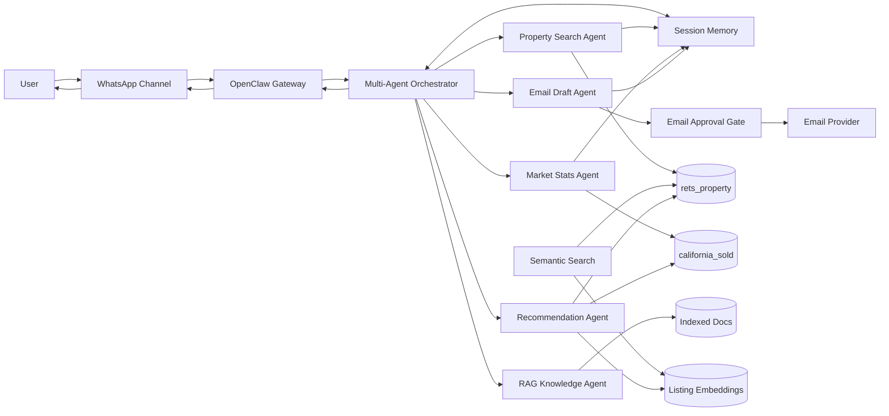

# Final Multi-Agent Architecture

This document summarizes the final Week 12 architecture for the IDX Multi-Agent Real Estate Assistant.

## System Overview

The assistant uses OpenClaw as the orchestration layer. WhatsApp is the user-facing channel, while the TypeScript skill package coordinates property search, market analytics, recommendations, RAG knowledge answers, and email workflows.

## Agent Responsibilities

| Agent | Main module | Primary source | Responsibility |
|---|---|---|---|
| `propertySearchAgent` | `skill/src/conversation.ts` | `rets_property` | Parse natural language filters, manage multi-turn search state, and return active listings. |
| `marketStatsAgent` | `skill/src/marketStats.ts` | `california_sold` | Summarize sold records into city-level market metrics and trends. |
| `recommendationAgent` | `skill/src/recommendationEngine.ts` | `rets_property` and `california_sold` | Recommend similar active listings and validate prices against sold comps. |
| `ragAgent` | `skill/src/ragAssistant.ts` | Indexed docs | Answer MLS field, real estate term, and market concept questions with citations. |
| `emailDraftAgent` | `skill/src/emailDraftAgent.ts` | Session context and aggregated data | Create email drafts for listing alerts, market reports, property summaries, and recommendation digests. |

## Runtime Flow

1. A user sends a WhatsApp message.
2. The OpenClaw Gateway forwards the message into the skill runtime.
3. `orchestrate(query, userId)` classifies intent as `search`, `market`, `recommend`, `knowledge`, `email`, `mixed`, or `unknown`.
4. The orchestrator calls the matching agent and passes the current user session.
5. Agents query only the data sources required for the request.
6. The session stores useful context such as recent listings, recent market results, and pending email drafts.
7. The WhatsApp handler formats the final response for mobile readability.

## Data Boundaries

- `rets_property` is used for active listing search, semantic listing text, and recommendation candidates.
- `california_sold` is used for market analytics, sold comps, trend summaries, and price validation.
- Indexed docs are used for RAG answers about terminology, field definitions, and project concepts.
- Email workflows use summarized listing or market context and never bulk-export raw MLS datasets.

## Safety Controls

- Database access uses parameterized query builders.
- Local `.env` files and credentials are not committed.
- RAG answers should cite indexed sources and avoid unsupported answers.
- Email workflows create pending drafts first.
- Sending requires the exact approval command `SEND EMAIL <draftId>`.
- Casual confirmations do not trigger email sending.

