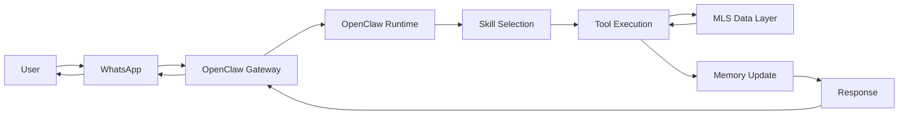

## Core concepts

OpenClaw is a multi-agent orchestration runtime that handles channel
integration, session state, skill routing, tool execution, and memory updates.
In an MLS-backed workflow, WhatsApp is the user-facing channel and the MLS data
layer is an external source that tools can query when a user asks about
properties, listings, or market data.

## Architecture flow



The request starts as a WhatsApp message, enters the Gateway, and becomes an
agent run. OpenClaw assembles the session context, loads the relevant skills,
lets the model choose tools, and records useful results in memory before sending
the final answer back through WhatsApp.

## Key components

- **WhatsApp channel** - receives user messages through the linked WhatsApp Web
  session and delivers replies back to the same conversation.
- **OpenClaw Gateway** - owns the long-running channel connection and exposes
  the request to the agent runtime.
- **Session state** - keeps each user conversation isolated so follow-up
  questions can use the right history.
- **Skills** - markdown instruction units that teach the agent when and how to
  use MLS-related tools.
- **Tools** - typed async functions that perform work such as listing search,
  market statistics lookup, or saved-search updates.
- **MLS data layer** - the external MLS API, SQL database, search index, or
  vector/RAG index used by the tools.
- **Memory** - stores durable preferences and useful session facts, such as a
  buyer's budget, preferred neighborhoods, property type, or timing.

## Basic tool definition

This example shows the shape of an MLS-oriented tool. It is documentation-only:
it does not connect to a real MLS provider or database.

```ts
type ListingSearch = {
  city: string;
  maxPrice?: number;
  bedrooms?: number;
};

export async function searchMlsListings(query: ListingSearch) {
  return {
    listings: [
      {
        id: "MLS-12345",
        city: query.city,
        bedrooms: query.bedrooms ?? 3,
        price: query.maxPrice ? Math.min(query.maxPrice, 750000) : 750000,
        status: "active",
      },
    ],
  };
}

export async function handleMessage(message: string) {
  const normalized = message.toLowerCase();

  if (normalized.includes("listing") || normalized.includes("property")) {
    return await searchMlsListings({
      city: "San Diego",
      maxPrice: 800000,
      bedrooms: 3,
    });
  }

  return { response: "I could not understand the request." };
}
```

In a production plugin, the tool would validate input, enforce access controls,
call the approved MLS API or database, and return a compact result that the
agent can summarize for WhatsApp.

## Deliverable

This architecture document explains how user queries flow from WhatsApp through
OpenClaw skills and tools to MLS databases or search systems. The workflow
diagram and tool example can be used as the starting point for a real estate
assistant design, while keeping the MLS provider details outside OpenClaw until
a concrete integration is selected.
